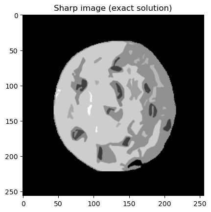
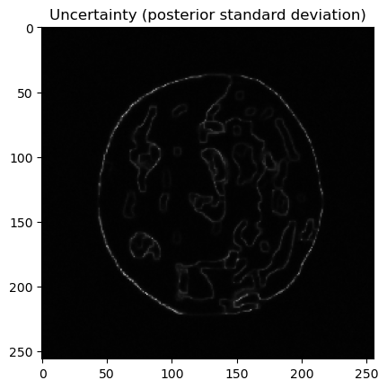

<div align="center">

</div>

# CUQIpy: Computational Uncertainty Quantification for Inverse Problems in python

[](https://github.com/CUQI-DTU/CUQIpy/actions/workflows/tests.yml)
[](https://cuqi-dtu.github.io/CUQIpy/)

 Computational Uncertainty Quantification for Inverse Problems in python (CUQIpy) is a python package for modeling and solving inverse problems in a Bayesian inference framework. CUQIpy provides a simple high-level interface to perform UQ analysis of inverse problems, while still allowing full control of the models and methods. The package comes equipped with a number of predefined distributions, samplers, models and test problems and is built to be easily further extended when needed.

You can find the full CUQIpy documentation [here](https://cuqi-dtu.github.io/CUQIpy/). 

 This software package is part of the [CUQI project](https://www.compute.dtu.dk/english/cuqi) funded by [the Villum Foundation.](https://veluxfoundations.dk/en/forskning/teknisk-og-naturvidenskabelig-forskning)

## Quick Example - UQ in 5 steps
Image deconvolution with uncertainty quantification
```python
# Imports
import numpy as np
import matplotlib.pyplot as plt
from cuqi.testproblem import Deconvolution2D
from cuqi.data import grains
from cuqi.distribution import Laplace_diff, GaussianCov 
from cuqi.problem import BayesianProblem

# Step 1: Model and data, y = Ax
A, y_data, info = Deconvolution2D.get_components(dim=128, phantom=grains())

# Step 2: Prior, x ~ Laplace_diff(0, 0.01)
x = Laplace_diff(location=np.zeros(A.domain_dim),
                 scale=0.01,
                 bc_type='neumann',
                 physical_dim=2)

# Step 3: Likelihood, y ~ N(Ax, 0.0036^2)
y = GaussianCov(mean=A@x, cov=0.0036**2)

# Step 4: Set up Bayesian problem and sample posterior
BP = BayesianProblem(y, x).set_data(y=y_data)
samples = BP.sample_posterior(200)

# Step 5: Analysis
info.exactSolution.plot(); plt.title("Exact solution")
y_data.plot(); plt.title("Data")
samples.plot_mean(); plt.title("Posterior mean")
samples.plot_std(); plt.title("Posterior standard deviation")
```





## Getting Started
To run `cuqipy` on your local machine, clone the `cuqipy` repository:

```{r, engine='bash', count_lines}
git clone https://github.com/CUQI-DTU/CUQIpy.git
```

Then go to the project directory:
```{r, engine='bash', count_lines}
cd cuqipy
```

You can run some demos, for example: 
```{r, engine='bash', count_lines}
cd demos
python demo00_MinimalExample.py 
```

### Required Dependencies
Requirements of cuqipy are listed in `cuqipy/requirements.txt` and can be installed via conda by (while in `cuqipy` directory)
```{r, engine='bash', count_lines}
conda install --file requirements.txt
```
or using pip by
```{r, engine='bash', count_lines}
pip install -r requirements.txt 
```

### Optional Dependencies
CUQIpy can be extended with additional functionality by installing optional plugins. These can be found at
[CUQI-DTU](https://github.com/CUQI-DTU).

## Running the Tests

To make sure that cuqipy runs as expected on your machine and that all requirements
are met, you can run the tests. While in the project
directory `cuqipy`, run:

```{r, engine='bash', count_lines}
python -m pytest 
```

## Building Documentation

To generate sphinx html documentation in your local machine, 
make sure you have working installation of sphinx and sphinx-rtd-theme. 
Then run the following commands in cuqipy directory:  

```{r, engine='bash', count_lines}
cd docs
sphinx-build -b html . _build
```

Then open docs/_build/index.html using your preferred web browser to browse
cuqipy documentation.

## Contributors

See the list of
[contributors](https://github.com/CUQI-DTU/CUQIpy/graphs/contributors)
who participated in this project.


