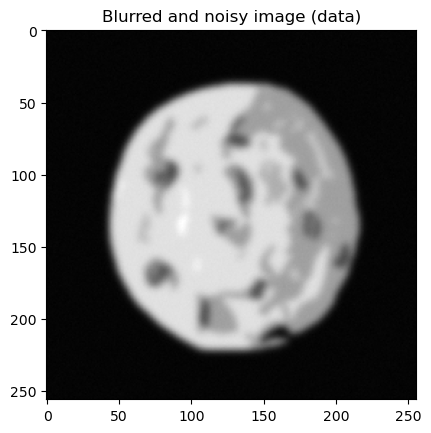
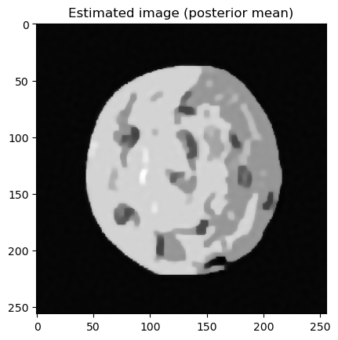

.. toctree::
   :maxdepth: 2
   :hidden:

   User Guide <user/index>
   API reference <api/index>
   Contributor's Guide <dev/index>

CUQIpy's Documentation
======================

Computational Uncertainty Quantification for Inverse Problems in python
(CUQIpy) is a python package for modeling and solving inverse problems
in a Bayesian inference framework. CUQIpy provides a simple high-level
interface to perform UQ analysis of inverse problems, while still
allowing full control of the models and methods. The package comes equipped with a number of predefined distributions,
samplers, models and test problems and is built to be easily further
extended when needed. A number of `CUQIpy Plugins`_ are available as separate packages that expand the functionality of CUQIpy.

This software package is part of the `CUQI
project <https://www.compute.dtu.dk/english/cuqi>`__ funded by `the
Villum
Foundation. <https://veluxfoundations.dk/en/forskning/teknisk-og-naturvidenskabelig-forskning>`__

**Quick Links**:
:ref:`Installation <install>` |
:doc:`Tutorials <user/_auto_tutorials/index>` |
:doc:`How-To Guides <user/_auto_howtos/index>` |
`Source Repository <https://github.com/CUQI-DTU/CUQIpy>`_ |
`CUQIpy Plugins`_

.. panels::
    :card: + intro-card text-center
    :column: col-lg-6 col-md-6 col-sm-6 col-xs-12 p-2

    ---
   
    .. image:: _static/img/get_start.png
       :width: 100px
       :alt: Getting started, image credit: https://freeicons.io.
   

    

    **Getting Started**
    ^^^^^^^^^^^^^^^^^^^

    Get CUQIpy up and running in your machine and learn the basics.

    +++

    .. link-button:: user/getting_started
            :type: ref
            :text: 
            :classes: stretched-link btn-link
    ---
    .. image:: _static/img/user_guide.png
       :width: 100px
       :alt: User guide, image credit: https://freeicons.io, CC BY-NC 3.0.
    

    **User Guide**
    ^^^^^^^^^^
    Step-by-step tutorials, how-to guide to help you accomplish various tasks with CUQIpy, and in-depth explanations of background theory. 

    +++

    .. link-button:: user/index
        :type: ref
        :text:
        :classes: stretched-link btn-link

    ---
    .. image:: _static/img/api.png
       :width: 100px
       :alt: API, image credit: https://freeicons.io.
    

    **API Reference**
    ^^^^^^^^^^^^^
    Detailed descriptions of CUQIpy library components (modules, classes, methods, etc.).

    +++

    .. link-button:: api/index
        :type: ref
        :text:
        :classes: stretched-link btn-link

    ---
    .. image:: _static/img/contributor.png
       :width: 100px
       :alt: Contributor, image credit: https://freeicons.io, CC BY 3.0.
    

    **Contributor's Guide**
    ^^^^^^^^^^^^^^^^^^^

    Here you find information on how to contribute to CUQIpy. All contributions are welcome, small and big!

    +++

    .. link-button:: dev/index
        :type: ref
        :text:
        :classes: stretched-link btn-link

Quick Example - UQ in five steps
--------------------------------
Image deconvolution with uncertainty quantification

.. code-block:: python

   # Imports
   import numpy as np
   import matplotlib.pyplot as plt
   from cuqi.testproblem import Deconvolution2D
   from cuqi.data import grains
   from cuqi.distribution import LMRF, Gaussian
   from cuqi.problem import BayesianProblem

   # Step 1: Model and data, y = Ax
   A, y_data, info = Deconvolution2D.get_components(dim=128, phantom=grains())

   # Step 2: Prior, x ~ LMRF(0, 0.01)
   x = LMRF(location=0,
            scale=0.01,
            bc_type='neumann',
            geometry=A.domain_geometry)

   # Step 3: Likelihood, y ~ N(Ax, 0.0036^2)
   y = Gaussian(mean=A@x, cov=0.0036**2)

   # Step 4: Set up Bayesian problem and sample posterior
   BP = BayesianProblem(y, x).set_data(y=y_data)
   samples = BP.sample_posterior(200)

   # Step 5: Analysis
   info.exactSolution.plot(); plt.title("Exact solution")
   y_data.plot(); plt.title("Data")
   samples.plot_mean(); plt.title("Posterior mean")
   samples.plot_std(); plt.title("Posterior standard deviation")

.. image:: _static/img/deconv2D_exact_sol.png
   :width: 49.5%
   :alt: Exact solution

.. image:: _static/img/deconv2D_post_std.png
   :width: 49.5%
   :alt: Posterior standard deviation

CUQIpy Plugins
--------------

A number of plugins are available as separate packages that expand the functionality of CUQIpy:

   - `CUQIpy-CIL: <https://github.com/CUQI-DTU/CUQIpy-CIL>`_ A plugin for the Core Imaging Library `(CIL) <https://ccpi.ac.uk/cil/>`_ providing access to forward models for X-ray computed tomography.

   - `CUQIpy-FEniCS: <https://github.com/CUQI-DTU/CUQIpy-FEniCS>`_ A plugin providing access to the finite element modelling tool `FEniCS <https://fenicsproject.org>`_, which is used for solving PDE-based inverse problems.

   - `CUQIpy-PyTorch: <https://github.com/CUQI-DTU/CUQIpy-PyTorch>`_ A plugin providing access to the automatic differentiation framework of `PyTorch <https://pytorch.org>`_ within CUQIpy. It allows gradient-based sampling methods without manually providing derivative information of distributions and forward models.

Contributors
------------

See the list of
`contributors <https://github.com/CUQI-DTU/CUQIpy/graphs/contributors>`__
who participated in this project.

