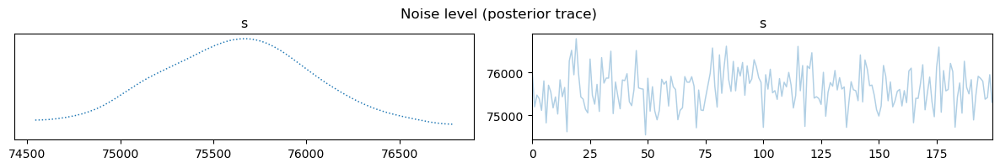

.. toctree::
   :maxdepth: 2
   :hidden:

   User Guide <user/index>
   API reference <api/index>
   Contributor's Guide <dev/index>

CUQIpy's Documentation
======================

CUQIpy stands for Computational Uncertainty Quantification for Inverse Problems in python.
It's a robust Python package designed for modeling and solving inverse problems using Bayesian inference.
Here's what it brings to the table:

- A straightforward high-level interface for UQ analysis.
- Complete control over the models and methods.
- An array of predefined distributions, samplers, models, and test problems.
- Easy extendability for your unique needs.

A number of CUQIpy Plugins are available as separate packages that expand the functionality of CUQIpy.

CUQIpy is part of the `CUQI
project <https://www.compute.dtu.dk/english/cuqi>`__ supported by `the
Villum
Foundation. <https://veluxfoundations.dk/en/forskning/teknisk-og-naturvidenskabelig-forskning>`__

**Quick Links**:
:ref:`Installation <install>` |
:doc:`Tutorials <user/_auto_tutorials/index>` |
:doc:`How-To Guides <user/_auto_howtos/index>` |
`Source Repository <https://github.com/CUQI-DTU/CUQIpy>`_ |
`🔌 CUQIpy Plugins`_

.. panels::
    :card: + intro-card text-center
    :column: col-lg-6 col-md-6 col-sm-6 col-xs-12 p-2

    ---
   
    .. image:: _static/img/get_start.png
       :width: 100px
       :alt: Getting started, image credit: https://freeicons.io.
   

    

    **Getting Started**
    ^^^^^^^^^^^^^^^^^^^

    Get CUQIpy up and running in your machine and learn the basics.

    +++

    .. link-button:: user/getting_started
            :type: ref
            :text: 
            :classes: stretched-link btn-link
    ---
    .. image:: _static/img/user_guide.png
       :width: 100px
       :alt: User guide, image credit: https://freeicons.io, CC BY-NC 3.0.
    

    **User Guide**
    ^^^^^^^^^^
    Step-by-step tutorials, how-to guide to help you accomplish various tasks with CUQIpy, and in-depth explanations of background theory. 

    +++

    .. link-button:: user/index
        :type: ref
        :text:
        :classes: stretched-link btn-link

    ---
    .. image:: _static/img/api.png
       :width: 100px
       :alt: API, image credit: https://freeicons.io.
    

    **API Reference**
    ^^^^^^^^^^^^^
    Detailed descriptions of CUQIpy library components (modules, classes, methods, etc.).

    +++

    .. link-button:: api/index
        :type: ref
        :text:
        :classes: stretched-link btn-link

    ---
    .. image:: _static/img/contributor.png
       :width: 100px
       :alt: Contributor, image credit: https://freeicons.io, CC BY 3.0.
    

    **Contributor's Guide**
    ^^^^^^^^^^^^^^^^^^^

    Here you find information on how to contribute to CUQIpy. All contributions are welcome, small and big!

    +++

    .. link-button:: dev/index
        :type: ref
        :text:
        :classes: stretched-link btn-link

🧪 Quick Example - UQ in a few lines of code
--------------------------------
Experience the simplicity and power of CUQIpy with this Image deconvolution example.
Getting started with UQ takes just a few lines of code:

.. code-block:: python

   # Imports
   import matplotlib.pyplot as plt
   from cuqi.testproblem import Deconvolution2D
   from cuqi.distribution import Gaussian, LMRF, Gamma
   from cuqi.problem import BayesianProblem

   # Step 1: Set up forward model and data, y = Ax
   A, y_data, info = Deconvolution2D(dim=256, phantom="cookie").get_components()

   # Step 2: Define distributions for parameters
   d = Gamma(1, 1e-4)
   s = Gamma(1, 1e-4)
   x = LMRF(0, lambda d: 1/d, geometry=A.domain_geometry)
   y = Gaussian(A@x, lambda s: 1/s)

   # Step 3: Combine into Bayesian Problem and sample posterior
   BP = BayesianProblem(y, x, d, s)
   BP.set_data(y=y_data)
   samples = BP.sample_posterior(200)

   # Step 4: Analyze results
   info.exactSolution.plot(); plt.title("Sharp image (exact solution)")
   y_data.plot(); plt.title("Blurred and noisy image (data)")
   samples["x"].plot_mean(); plt.title("Estimated image (posterior mean)")
   samples["x"].plot_std(); plt.title("Uncertainty (posterior standard deviation)")
   samples["s"].plot_trace(); plt.suptitle("Noise level (posterior trace)")
   samples["d"].plot_trace(); plt.suptitle("Regularization parameter (posterior trace)")

.. image:: _static/img/deconv2D_exact_sol.png
   :width: 49.5%
   :alt: Sharp image (exact solution)

.. image:: _static/img/deconv2D_data.png
   :width: 49.5%
   :alt: Blurred and noisy image (data)

.. raw:: html

    

.. image:: _static/img/deconv2D_post_mean.png
   :width: 49.5%
   :alt: Estimated image (posterior mean)

.. image:: _static/img/deconv2D_post_std.png
   :width: 49.5%
   :alt: Uncertainty (posterior standard deviation)

.. raw:: html

    

.. raw:: html

    

.. image:: _static/img/deconv2D_regularization_parameter.png
   :width: 99%
   :alt: Regularization parameter (posterior trace)

🔌 CUQIpy Plugins
--------------

A number of plugins are available as separate packages that expand the functionality of CUQIpy:

   - `CUQIpy-CIL: <https://github.com/CUQI-DTU/CUQIpy-CIL>`_ A plugin for the Core Imaging Library `(CIL) <https://ccpi.ac.uk/cil/>`_ providing access to forward models for X-ray computed tomography.

   - `CUQIpy-FEniCS: <https://github.com/CUQI-DTU/CUQIpy-FEniCS>`_ A plugin providing access to the finite element modelling tool `FEniCS <https://fenicsproject.org>`_, which is used for solving PDE-based inverse problems.

   - `CUQIpy-PyTorch: <https://github.com/CUQI-DTU/CUQIpy-PyTorch>`_ A plugin providing access to the automatic differentiation framework of `PyTorch <https://pytorch.org>`_ within CUQIpy. It allows gradient-based sampling methods without manually providing derivative information of distributions and forward models.

🌟 Contributors
------------

A big shoutout to our passionate team! Discover the talented individuals behind CUQIpy
`here <https://github.com/CUQI-DTU/CUQIpy/graphs/contributors>`__.
